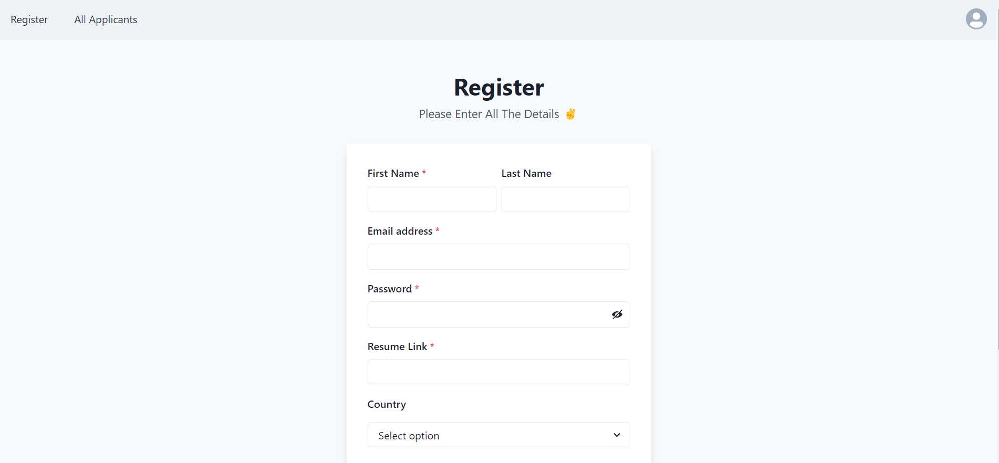

<!DOCTYPE html>
<html>
  <head>
    <meta charset="UTF-8">
    <title>Applicant Management System README</title>
  </head>
  <body>
    <h1>Applicant Management System</h1>
    
This is a web application for managing job applicants. It allows users to register and submit their job applications, and provides an interface for admins to view and manage the applications.

    <h2>API Endpoints</h2>

The API endpoints for this application are:

<h3>GET /applicants</h3>

Returns a list of all applicants.

<h4>Request parameters:</h4>
<ul>
  <li>None</li>
</ul>

<h4>Response:</h4>
<ul>
  <li><code>200 OK</code> with a JSON array of applicants on success.</li>
  <li><code>404 Not Found</code> on error.</li>
</ul>

<h3>POST /register</h3>

Registers a new user and creates a new applicant record.

<h4>Request body:</h4>
<ul>
  <li><code>firstname</code>: String, required</li>
  <li><code>lastname</code>: String, required</li>
  <li><code>password</code>: String, required</li>
  <li><code>resume</code>: String, optional</li>
  <li><code>country</code>: String, required</li>
  <li><code>gender</code>: String, required</li>
  <li><code>email</code>: String, required</li>
</ul>

<h4>Response:</h4>
<ul>
  <li><code>200 OK</code> with the new user's record on success.</li>
  <li><code>500 Internal Server Error</code> on error.</li>
</ul>
  </body>
</html>

<h2>Registration page</h2>

 
 
<h2>Applicants Page</h2>

